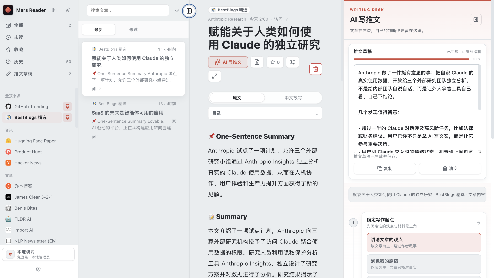
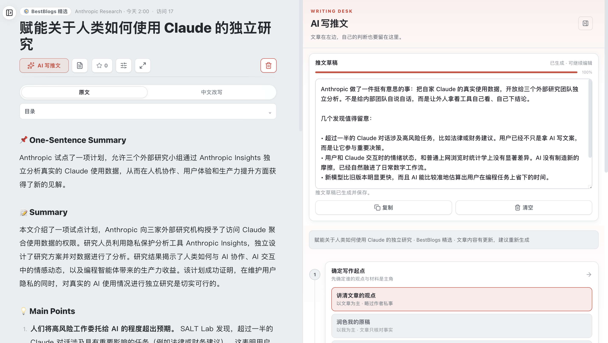
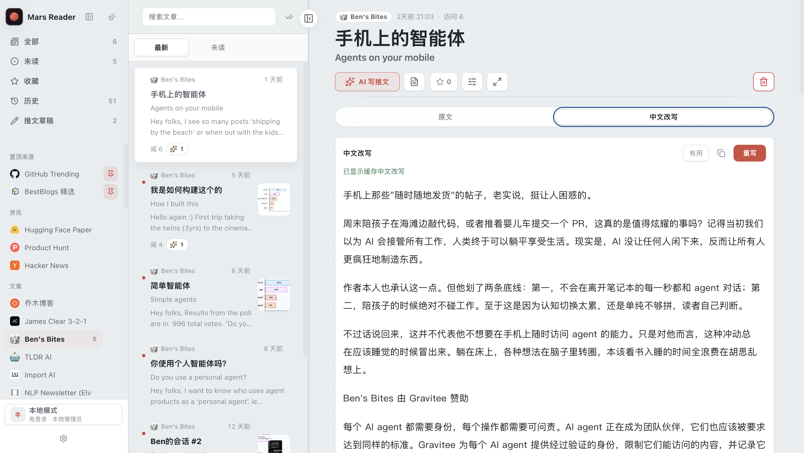

# Mars Reader｜火星阅读阅读器

[中文](#mars-reader火星阅读阅读器) · [English](#english)

> 基于 [QMReader](https://github.com/joeseesun/qmreader) 演化的个人版 RSS 阅读与写作工作台。

Mars Reader 把筛选信息、深读文章、读中文改写、形成自己的判断，以及写成一条可继续编辑的推文，收进同一个本地优先的界面。它保留 QMReader 的 RSS 阅读、中文改写和文章上下文能力，在此基础上为个人阅读—写作流程加入了 AI 写推文工作台与更收束的三栏界面。



## 这是什么

这不是把文章自动变成一条看似合理的内容，而是一个让阅读和表达连在一起的个人工作台：

1. 在左侧筛选信息源、未读、收藏、历史和文章；
2. 在中间阅读原文、摘要和中文改写；
3. 在右侧保留自己的判断，决定是同观点重写、润色原稿，还是用文章补充论点；
4. 生成后继续编辑、复制或清空草稿。草稿按文章保存，不会因为切换文章而丢失。

## V1.0 的重点变化

### AI 写推文：文章在左，判断留在自己手里

点击阅读器工具栏最前面的“AI 写推文”即可打开右侧 Writing Desk。它提供三种清晰的写作起点：

- **同观点重写**：以文章的公共观点和事实为材料，换一套结构与措辞表达；会移除原文链接，也不把原作者的第一人称经历改成你的经历。
- **润色我的原稿**：以你输入的感想、判断或草稿为主，文章只用于核对事实与补足背景。
- **用文章补充我的观点**：仍以你的观点为主，文章只补充必要论据，不替你发明判断。

输出会根据内容选择自然段与局部要点；需要列举时才使用真正的项目符号，而不是把整条推文机械切成段落或编号。每次生成的草稿都可直接修改、复制、清空，并保留生成状态与内容更新提示。



### 中文改写：在阅读器里读懂，而不必离开文章

阅读区提供 `原文`、`中文改写` 与 `中文改写（对照）` 三个视图。对于有正文的文章，可以在同一处生成中文改写、查看生成状态、复制内容，并在需要时回到原文逐段核对。中文改写与 AI 写推文是两套能力：前者服务于阅读理解，后者服务于你的写作表达。



### 更简洁的阅读—写作界面

当前桌面工作台把角色分开，而不是让所有工具同时争抢注意力：

- **左侧**：信息源导航、文章列表、搜索和个人阅读状态；
- **中间**：文章标题、原文、中文改写、摘要和正文；
- **右侧**：仅在写作时展开的 AI 写推文工作台，包含可折叠的步骤引导与可编辑草稿；
- **工具栏**：AI 写推文优先放在最前；进入写作状态后，关闭控制移动到写作台标题行，减少重复标题与重复按钮。

## 功能地图

| 能力 | 用途 |
| --- | --- |
| 多源 RSS 阅读 | 聚合 RSSHub、直接 RSS、站点地图、Hacker News、Product Hunt、GitHub Trending、Hugging Face Papers 等信息源。 |
| 阅读工作台 | 在一页内完成信息源筛选、文章列表、深读和个人阅读状态管理。 |
| 中文改写 | 在文章阅读器中生成与查看中文改写，也可切换到对照视图。 |
| AI 写推文 | 围绕文章与自己的判断生成可编辑草稿，支持同观点重写、原稿润色和论点补充。 |
| 个人阅读状态 | 未读、收藏、历史和已保存的推文草稿按文章沉淀。 |
| 文章上下文工具 | 保留文章级 AI 对话、点评和划线等既有阅读能力。 |
| 自托管与本地优先 | 使用 Express 与 SQLite 运行；服务端密钥放在环境变量，浏览器自定义 AI 配置保留在本机。 |

## 本地启动

### 1. 准备环境

需要已安装当前 Node.js LTS 与 npm。

```bash
git clone https://github.com/archerthegoat/MarsReader.git
cd MarsReader
npm install
cp .env.example .env
```

`.env` 不应提交到 Git。只阅读 RSS 内容时可以先保持 AI Key 为空；要使用服务端中文改写等能力时，再填入自己的 DeepSeek 或兼容配置。

### 2. 正常启动

```bash
npm start
```

默认访问地址：<http://localhost:8080>

这是正常服务模式，遵循 `.env` 中的认证、Host、端口与 Cookie 配置，适合本地常驻或部署前验证。

### 3. 本地热更新开发

```bash
npm run dev:hot
```

默认访问地址：<http://marsreader.localhost:18081/>

这个命令监听后端与前端关键文件，改动后自动重启本地服务；它默认仅绑定 `127.0.0.1`，并启用本地调试用的认证绕过。它只适合自己的电脑，不应暴露到局域网或公网。

### 4. 在页面内配置 AI

除 `.env` 的服务端配置外，也可以在界面内维护自己的浏览器 AI 配置：点击左下角的**设置**图标，选择**我的后台**，再进入**AI 设置**。

- 在这里添加或切换 AI 配置，可填写 API Key、Base URL、模型、Temperature 与 Max Tokens，并可测试连接或设为默认；
- 同一页的“**推文改写规则**”用于编辑**推文改写系统提示词**，以及“分享改写规则”和“观点感想规则”；它们只影响“AI 写推文”，不影响中文改写和 AI 伴读；
- 这些页面内 AI 配置与推文规则都保存在当前浏览器，可随时点“恢复默认”还原推文规则；不会写入 SQLite 或提交到 Git。

### 5. 验证

```bash
npm test
node --check server.js
node --check public/app.js
```

## 配置速览

从 `.env.example` 复制后，最常用的是：

| 变量 | 说明 |
| --- | --- |
| `DEEPSEEK_API_KEY` / `DEEPSEEK_MODEL` / `DEEPSEEK_BASE_URL` | 服务端中文改写等 AI 能力的默认配置。 |
| `AI_PROVIDER` / `AI_API_KEY` / `AI_BASE_URL` / `AI_MODEL` | 兼容 AI Provider 的服务端配置。 |
| `ADMIN_EMAIL` / `ADMIN_PASSWORD` / `ADMIN_NAME` | 管理员初始配置。 |
| `HOST` / `PORT` | 正常服务模式的监听地址与端口。 |
| `MARSREADER_LOCAL_AUTH_BYPASS` | 仅用于本机热更新调试；正常启动应保持关闭。 |
| `AUTO_REWRITE_ENABLED` / `AUTO_REWRITE_SOURCE_IDS` | 可选的后台自动改写范围。 |

运行时 SQLite 数据和 favicon 缓存保存在 `data/`，默认不纳入 Git。

## 隐私与边界

- 服务端 API Key 只从环境变量或 `.env` 读取，不写入仓库；
- 浏览器中自行配置的 AI Key 保存在该浏览器的 localStorage，不存入 SQLite；
- AI 输出依赖所选 Provider、模型和额度，生成前应自行确认事实与表达；
- 分享改写会移除文章来源链接，但这不代替你对公开表达、素材使用和发布平台规则的判断；
- SQLite 适用于个人或小团队自托管，不是高并发多租户方案。

## 来源、贡献者与许可证

Mars Reader 基于 [joeseesun/qmreader](https://github.com/joeseesun/qmreader) 开发，现作为独立仓库维护。原项目来源、版权与 MIT License 必须保留；本项目并不把上游代码叙述为从零创作。

### Contributors

- [@archerthegoat](https://github.com/archerthegoat) — 产品方向、需求与验收
- Codex — 开发协作

MIT License. See [LICENSE](LICENSE).

---

<a name="english"></a>

# English

> A personal RSS reading and writing workbench built on [QMReader](https://github.com/joeseesun/qmreader).

Mars Reader keeps feed aggregation, article reading, Chinese rewrites, and article-context tools from QMReader, then adapts them to a personal workflow: filter information, read deeply, keep your own judgment, and turn it into an editable X post draft.

## What changed in V1.0

- **AI tweet writing desk** — choose between rewriting a shared viewpoint, polishing your own draft, or supplementing your judgment with article evidence. Drafts are saved per article and remain editable.
- **Chinese rewrites in the reader** — switch among original text, Chinese rewrite, and a comparison view without leaving the article.
- **A more focused desktop surface** — source navigation and article list on the left, deep reading in the middle, and an on-demand writing desk on the right.
- **Local-first self-hosting** — Express and SQLite power the app; server keys stay in environment variables and browser AI profiles stay in local storage.

## Local quick start

```bash
git clone https://github.com/archerthegoat/MarsReader.git
cd MarsReader
npm install
cp .env.example .env
npm start
```

Open <http://localhost:8080>.

For local hot reload only:

```bash
npm run dev:hot
```

Open <http://marsreader.localhost:18081/>. This mode binds to localhost and enables a local-only auth bypass; never expose it to a LAN or the public internet.

## Configure AI in the app

In addition to `.env` server settings, you can manage browser-local AI settings from the interface: click the **settings** icon at the lower-left, choose **My Dashboard**, then open **AI Settings**.

- Add or switch AI profiles with an API key, base URL, model, temperature, and max tokens; test the connection or make a profile the default.
- The **Tweet rewrite rules** section on the same page contains the **Tweet rewrite system prompt**, plus separate rules for shared-viewpoint rewrites and personal reflections. These rules affect only **AI tweet writing**, not Chinese rewrites or the article AI companion.
- Browser AI profiles and tweet-writing rules stay in the current browser. Use **Restore defaults** to reset the tweet rules; nothing is written to SQLite or Git.

## Credits and license

Mars Reader is independently maintained from QMReader while retaining its upstream attribution and MIT license.

- [@archerthegoat](https://github.com/archerthegoat) — product direction, requirements, and acceptance
- Codex — development collaboration

MIT License. See [LICENSE](LICENSE).
